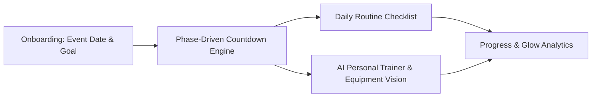
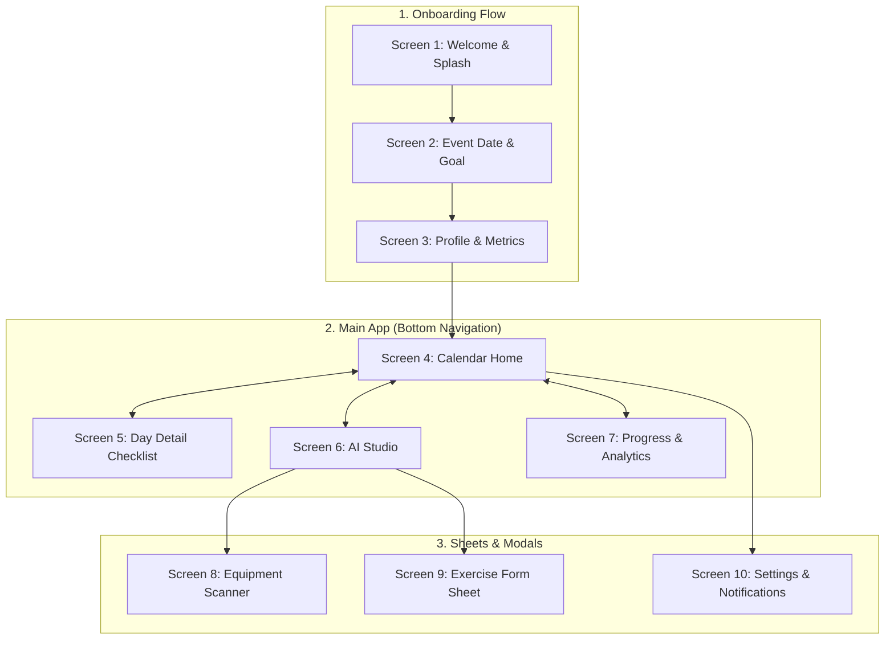
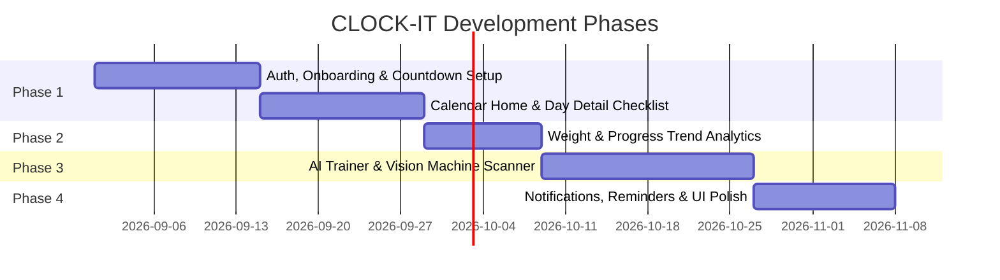

# CLOCK-IT — Master Product Specification & Architecture Document (v1 Archive)

> [!NOTE]
> **SUPERSEDED BY [CLOCK-IT-VISION-2.0.md](CLOCK-IT-VISION-2.0.md) & [ADR 0002](docs/adr/0002-clock-it-2-architecture-and-safety-guardrails.md)**  
> The "AI Diet Planner" and restrictive diet/calorie tracking described below have been officially removed from the product scope. CLOCK-IT 2.0 focuses strictly on milestone countdown, skincare, body care, phase-adaptive movement, and wellness habits.

> *"Your glow, on the clock."*  


---

## 1. Executive Summary & Vision

**CLOCK-IT** is designed for women preparing for major life milestones (weddings, galas, competitions, or personal milestone dates). It bridges the gap between static habit trackers and high-end personal coaching by dynamically adjusting daily self-care, skincare, nutrition, and workout intensity based on a live countdown to the user's **"Big Day"**.



---

## 2. Core Pillars & Value Proposition

| Pillar | Description |
|---|---|
| **Audience Focus** | Public, women-only community space with an empowering, luxury self-care aesthetic. |
| **Countdown-Driven Intensity** | Daily requirements dynamically adapt across 3 countdown phases to peak on the event date. |
| **Complete Self-Care Hub** | Unifies AM/PM weight, skincare, hair & body care, and workout routines in one calendar interface. |
| **Phase-Adaptive Wellness** | Dynamic wellness and hydration routines tailored to countdown phases (Foundation / Intensify / Final Prep). |
| **AI Gym Companion** | Generates split-based workouts and uses camera computer vision to identify gym equipment and guide form. |

---

## 3. The 3-Phase Countdown Engine

All routines and recommendations are anchored to the user's countdown to the Big Day:

```
[ Day 180 ────── Foundation ────── Day 90 ────── Intensify ────── Day 30 ────── Final Prep ────── Day 0 ]
```

### Phase 1: Foundation (180–90 Days Out)
- **Fitness Focus**: Baseline strength, form mastering, consistency building.
- **Hydration & Wellness**: Hydration baseline, sleep consistency, recovery tracking.
- **Skincare/Body**: Long-term skin barrier repair, hair health regimens.

### Phase 2: Intensify (90–30 Days Out)
- **Fitness Focus**: Progressive overload, targeted toning splits (Legs, Glutes, Core, Full Body).
- **Hydration & Wellness**: Electrolyte balance, targeted debloating strategies, restorative practices.
- **Skincare/Body**: Targeted treatments, exfoliation cycles, lymphatic drainage.

### Phase 3: Final Prep & Taper (30–0 Days Out)
- **Fitness Focus**: Tapering workout strain to prevent fatigue/injury, active recovery, posture alignment.
- **Hydration & Wellness**: Anti-inflammatory rest, glow-boosting hydration, stress management.
- **Skincare/Body**: Deep hydration, gentle glow treatments, resting routines.

### Post-Event Mode (Day 0+)
- Transitions into an evergreen **"Maintenance & Glow"** mode or allows setting a new milestone date.

---

## 4. Complete Screen & UX Architecture (10 Screens)



### Screen Breakdown:

#### 1. Splash & Auth (`Screen 1`)
- **Visuals**: Soft blush/peach glow, 3D clock hero, brand tagline *"your glow, on the clock"*.
- **Controls**: "Get started ✦" CTA, "Already prepping? Log in" action, women-only community pledge.
- **Intro Carousel**: 3 slides (Countdown Concept → Self-Care Hub → AI Trainer).

#### 2. Event & Goal Setup (`Screen 2`)
- **Controls**: Date picker for the Big Day, Event Type tag (Wedding, Gala, Vacation, Personal Milestone).
- **Goal Cards**: *Tone & Sculpt*, *Maintain & Glow*, *Energy & Wellness*.

#### 3. Profile & Baseline Metrics (`Screen 3`)
- **Inputs**: Name, Age, Height (cm/ft), Current Weight, Target Weight.
- **Preferences**: Focus areas (Skincare, Hair care, Body toning, Posture & Movement).

#### 4. Calendar Home (`Screen 4` — Tab 1 Hub)
- **Header**: Big Day Countdown card (*"142 Days Remaining"*), Current Phase Badge (*Foundation*), Overall Progress ring.
- **Body**: Interactive monthly calendar grid with daily completion rings.
- **Footer Card**: Today's routine quick-preview with single-tap navigation to Day Detail.

#### 5. Day Detail (`Screen 5` — Tab 2 Checklist)
- **Top Bar**: Date switcher (`< Today, Aug 20 >`).
- **Module 1 (Weight)**: AM and PM weight log fields.
- **Module 2 (Skincare)**: AM (Cleanser, Vitamin C, SPF) and PM (Double cleanse, Retinol, Night cream).
- **Module 3 (Bath & Body)**: Body scrub, lotion, hair oiling / wash day checklist.
- **Module 4 (Hydration & Wellness)**: Water intake tracker, mindfulness, and sleep notes.
- **Module 5 (Workout Split)**: Split title (e.g., *Legs & Core*) with exercise checklist.

#### 6. AI Studio (`Screen 6` — Tab 3)
- **Top Segmented Switcher**: `[ Workout Plan ]` | `[ AI Coach ]`
- **Workout Plan Tab**: Phase-appropriate exercises (Sets, Reps, Rest timers), "Snap Machine" Floating Action Button (FAB).
- **AI Coach Chat Tab**: Gym form Q&A, dos & don'ts, built-in form guidance and medical disclaimers.

#### 7. Progress & Analytics (`Screen 7` — Tab 4)
- **Charts**: Dual-line AM vs PM weight trend with goal projection.
- **Habit Consistency**: Monthly adherence heatmap and active streak badge.
- **Milestones**: Phase progression meter and measurement logs (waist, hips, etc.).

#### 8. Equipment Vision Scanner (`Screen 8` — Full Camera)
- **Camera Viewfinder**: Live viewfinder with bounding box and snap trigger.
- **AI Recognition Result**: Machine name, confidence score, target muscle group, and recommended seat/pin setup.

#### 9. Exercise Form & Cues Sheet (`Screen 9` — Bottom Sheet)
- **Content**: Exercise demo animation, muscle highlights, key form cues, common mistakes to avoid, and safe substitution options.

#### 10. Profile & Settings (`Screen 10`)
- **Settings**: Edit event date, notification schedule (Morning weigh-in alert at 7:00 AM, Night routine alert at 9:30 PM), data export, account deletion.

---

## 5. Technical Architecture

```
┌─────────────────────────────────────────────────────────────┐
│                    Mobile Client (Android)                  │
│       React Native / Jetpack Compose / Responsive Web       │
└──────────────────────────────┬──────────────────────────────┘
                               │ HTTPS / JSON REST
                               ▼
┌─────────────────────────────────────────────────────────────┐
│                   Backend: Spring Boot 3.x                  │
│   ├── Auth & JWT Security (Women-Only Verification)         │
│   ├── Routine & Checklist Service                           │
│   ├── Countdown & Phase Computation Engine                  │
│   ├── AI Orchestrator (Claude / Gemini API Integration)     │
│   └── Analytics & Progress Service                          │
└──────────────┬──────────────────────────────┬───────────────┘
               │                              │
               ▼                              ▼
┌──────────────────────────────┐ ┌────────────────────────────┐
│    PostgreSQL Database       │ │   Redis (Cache & Sessions) │
│ - Users & Profiles           │ │ - Active JWT Tokens        │
│ - DailyLogs & Habits         │ │ - Daily Routine Cache      │
│ - WorkoutPlans & Routines    │ │ - Rate Limiting            │
│ - Equipment Inventories      │ └────────────────────────────┘
└──────────────────────────────┘
```

### Core Database Entities:
1. `User`: `id`, `name`, `email`, `event_date`, `event_type`, `phase`, `goal`, `height`, `starting_weight`, `target_weight`, `created_at`.
2. `DailyLog`: `id`, `user_id`, `date`, `weight_am`, `weight_pm`, `skincare_am_done`, `skincare_pm_done`, `bodycare_done`, `haircare_done`, `exercise_completed`.
3. `WorkoutPlan`: `id`, `user_id`, `date`, `split_type`, `phase`, `exercises_json`, `estimated_duration_min`, `completed`.
4. `Equipment`: `id`, `name`, `category`, `vision_labels`, `target_muscles`, `instructions`, `safety_notes`.
5. `ChatMessage`: `id`, `user_id`, `session_id`, `sender` (USER/AI), `content`, `timestamp`.

---

## 6. AI Subsystem Design & Prompts

### AI Personal Trainer & Vision Recognition
- **Model**: Claude 3.5 Sonnet (Vision) / Gemini 1.5 Flash.
- **Input**: Image upload of gym machine or workout area.
- **Output**:
  ```json
  {
    "machine_name": "Seated Cable Row",
    "confidence": 0.94,
    "primary_muscle": "Upper Back / Rhomboids",
    "secondary_muscle": "Biceps",
    "seat_setup_guide": "Adjust chest pad so arms are fully extended when gripping handles.",
    "suggested_exercises": [
      { "name": "Neutral Grip Cable Row", "sets": 3, "reps": "10-12", "phase_focus": "Foundation" }
    ],
    "safety_disclaimer": "Keep spine neutral. Do not round lower back during heavy pulls."
  }
  ```

---

## 7. Phased Implementation Roadmap



- **Milestone 1**: UI Design complete in Figma (10 screens).
- **Milestone 2**: Spring Boot Backend API scaffolded with PostgreSQL schemas.
- **Milestone 3**: Mobile Frontend Core (Calendar + Daily Log CRUD).
- **Milestone 4**: AI Trainer & Equipment Vision Scanner integration.
- **Milestone 5**: Full end-to-end polish and release.

---

## 8. Success Metrics & Quality Standards

1. **Adherence Rate**: Percentage of users completing at least 4 out of 5 daily checklist modules.
2. **AI Response Latency**: < 3s for Vision Equipment Recognition.
3. **Safety First**: Every AI exercise recommendation contains clear form cues and professional consultation disclaimers.
4. **Visual Delight**: 60fps smooth animations on calendar date transitions and micro-interactions on checklist completions.
