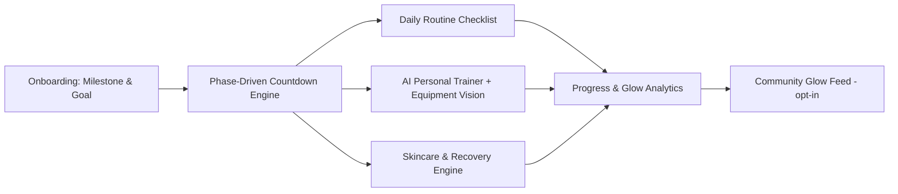
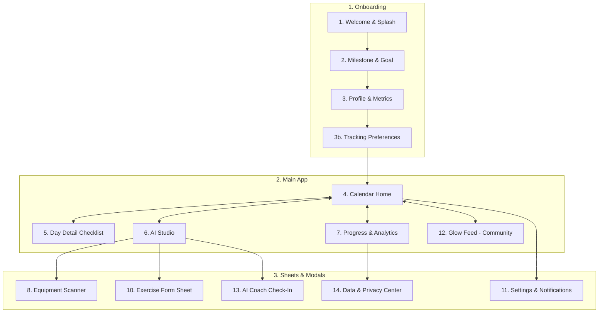
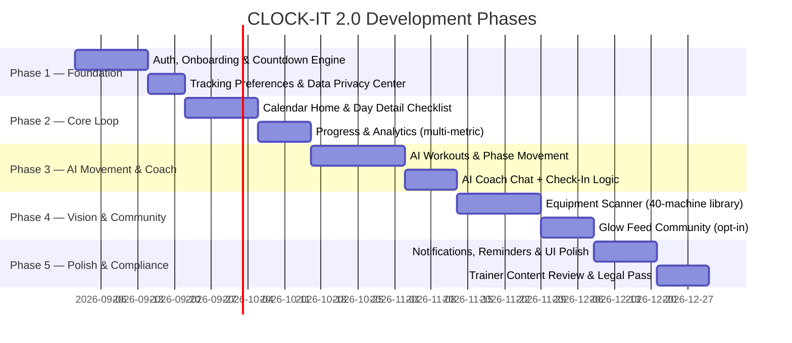

# CLOCK-IT 2.0 — Product Vision & Architecture (Revised)

> *"Your glow, on the clock."*
> An all-in-one, milestone-driven self-care companion — skincare, hair & body care, phase-adaptive movement, daily habits, and AI coaching, adapting daily to any countdown you set for yourself.

---

## 0. What Changed From v1 — And Why

| v1 | v2.0 | Reason |
|---|---|---|
| Women-Only Verification (auth-level) | Women-focused brand & tone, open access | Verification is legally unenforceable and a compliance risk; brand identity doesn't need a gate |
| Mandatory AM/PM weigh-ins | Optional, user-toggled tracking | Removes the #1 driver of anxiety-based churn |
| "Debloating," "bloat prevention" copy | "Energy," "recovery," "readiness" copy | Avoids diet-culture framing; same science, healthier narrative |
| Wedding-first onboarding | Milestone-neutral onboarding | Wedding is one scenario among many (races, postpartum return, galas, "just for me" goals) |
| Disclaimer string in AI JSON | Trainer-reviewed workout prompt templates + in-app disclaimers | A disclaimer isn't a substitute for safe, evidence-based recommendations |
| Scale as primary progress metric | Scale, measurements, photos, energy/mood — user picks | Removes implicit message that weight is the "real" metric |
| No community layer | Opt-in "Glow Feed" | Activates the "public women-focused community" pillar that v1 named but never built |
| 18-day vision scanner scope: "any machine" | Curated 40-machine library for v1, expandable | Realistic CV scope; ships reliable, not flashy-but-broken |

The goal of this revision: an app that makes people feel **capable and cared for**, not surveilled by a countdown. Reliability and trust compound into retention; pressure and shame do not.

---

## 1. Executive Summary & Vision

**CLOCK-IT** helps anyone preparing for a personally meaningful date — a wedding, a race, a return to fitness after a life change, a milestone birthday, or no occasion at all beyond "the next 90 days of my life" — build daily skincare, body care, movement, and wellness habits that intelligently adapt as the date approaches.

It is the only app that unifies these core self-care pillars under a single adaptive engine, instead of forcing users to stitch together separate apps.



---

## 2. Core Pillars & Value Proposition

| Pillar | Description |
|---|---|
| **Milestone-Neutral Design** | Works for weddings, races, postpartum return, competitions, birthdays, or "just because." No single scenario is privileged in copy or UI. |
| **Countdown-Driven Intensity** | Daily requirements adapt across 4 phases (see below) to build sustainably toward peak readiness. |
| **Complete Self-Care Hub** | Skincare, body care, daily habits, fitness, and recovery in one calendar — no app-switching. |
| **Phase-Adaptive Movement** | Workouts and movement routines that intelligently adapt across 4 phases to your milestone date. |
| **AI Gym Companion + Equipment Vision** | Camera-based machine recognition (curated library) with form guidance and safe substitutions. |
| **Non-Scale Progress Options** | Weight is one optional metric among several — measurements, photos, energy, sleep, mood. |
| **Opt-in Community** | A women-focused, non-competitive social layer for milestones and encouragement — no forced comparison. |

---

## 3. The 4-Phase Adaptive Engine

Renamed and reframed around **readiness**, not restriction.

```
[ Day 180 ── Foundation ── Day 90 ── Build ── Day 30 ── Refine ── Day 7 ── Arrival ── Day 0 ]
```

### Phase 1: Foundation (180–90 Days Out)
- **Fitness**: Baseline strength, form mastery, consistency over intensity.
- **Skin & Body**: Barrier repair, hair health, habit-stacking (not treatment-heavy yet).
- **Daily Habits**: Hydration consistency, sleep routine, mindfulness check-in.
- **Tone**: "Let's build a routine you can actually keep."

### Phase 2: Build (90–30 Days Out)
- **Fitness**: Progressive overload, targeted splits, mobility work.
- **Skin & Body**: Targeted treatments, exfoliation cycles, lymphatic self-massage (opt-in).
- **Daily Habits**: Rest-day discipline, recovery habits.
- **Tone**: "You're getting stronger — let's sharpen the details."

### Phase 3: Refine (30–7 Days Out)
- **Fitness**: Tapering intensity, injury-prevention focus, posture and mobility.
- **Skin & Body**: Deep hydration, gentle glow treatments, stress management, sleep hygiene.
- **Daily Habits**: Energy restoration, calming rituals.
- **Tone**: "You've done the work. Now we protect your energy."

### Phase 4: Arrival (7–0 Days Out)
- **Fitness**: Light movement only, rest prioritized.
- **Skin & Body**: Final prep rituals, calm-focused, no last-minute drastic treatments recommended.
- **Daily Habits**: Hydration, deep rest, mental readiness.
- **Tone**: "Trust the process. You're ready."

### Post-Milestone: "Maintenance & Glow" Mode
- Automatically offered at Day 0 — evergreen habit mode, or set a new milestone.
- Explicitly marketed *during onboarding*, not just at the end, so users know this isn't a one-shot app.

**Hard rule baked into the AI orchestrator**: no phase, at any countdown distance, may generate excessive workout volume or unverified routines. Deadline proximity never overrides recovery and readiness.

---

## 4. Screen & UX Architecture (14 Screens)



### Key New/Changed Screens

**3b. Tracking Preferences (NEW)** — User chooses which metrics matter to them: weight, measurements, progress photos (private by default), energy/mood, sleep, or "none of the above, just habits." This runs *before* the first daily checklist so tracking never feels mandatory.

**12. Glow Feed (NEW)** — Opt-in, non-competitive community space. Users can share milestone completions, streaks, or encouragement posts. No follower counts, no like-based ranking, no photo requirement. Designed to activate the "community" pillar without becoming a comparison trap.

**13. AI Coach Check-In (NEW)** — Triggered automatically (not user-initiated) when the system detects patterns like skipping rest days or excessive workout volume. Sends a gentle, non-judgmental prompt: *"Want to adjust your plan, or just check in with how you're feeling?"* Never diagnostic, always optional, always exits cleanly if dismissed.

**14. Data & Privacy Center (NEW)** — One place for export, deletion, and clear plain-language explanation of what health data is stored and why (health/biometric data is sensitive-category under GDPR, CCPA, and most emerging state privacy laws — build this in from day one rather than retrofitting).

**4. Calendar Home** — Countdown card now reads *"142 Days to [Your Milestone]"* with phase badge, but weight/measurement trend is **not** shown on this card by default — it lives in Progress & Analytics, opt-in.

**5. Day Detail** — Weight module is now collapsible/optional per user's Screen 3b preference. Daily checklist highlights skincare, hair & body care, daily movement, and hydration/habits.

**6. AI Studio** — Focuses on Phase-Adaptive Workouts, Equipment Scanner, and AI Coach Chat.

---

## 5. Technical Architecture

```
┌──────────────────────────────────────────────────────────────┐
│              Mobile Client (Android/iOS)                      │
│         React Native (shared codebase, faster ship)           │
└───────────────────────────────┬───────────────────────────────┘
                                │ HTTPS / JSON REST
                                ▼
┌──────────────────────────────────────────────────────────────┐
│                  Backend: Spring Boot 3.x                    │
│   ├── Auth & JWT Security (standard, no gender-gating)        │
│   ├── Routine & Checklist Service                             │
│   ├── Countdown & Phase Computation Engine                    │
│   ├── AI Orchestrator (Claude API)                             │
│   ├── Analytics & Progress Service                             │
│   └── Community Service (Glow Feed, moderation queue)          │
└───────────────┬────────────────────────────┬───────────────────┘
                ▼                            ▼
┌───────────────────────────────┐ ┌─────────────────────────────┐
│    PostgreSQL Database         │ │   Redis (Cache & Sessions)  │
│ - Users & Profiles              │ │ - Active JWT Tokens         │
│ - DailyLogs & Habits            │ │ - Daily Routine Cache       │
│ - WorkoutPlans                  │ │ - Rate Limiting             │
│ - Equipment Library             │ └─────────────────────────────┘
│ - CommunityPosts (opt-in)       │
│ - ConsentLog (privacy/audit)    │
└───────────────────────────────┘
```

### Core Database Entities (Updated)

1. **User**: `id`, `name`, `email`, `milestone_date`, `milestone_type`, `phase`, `goal`, `height`, `starting_weight` *(nullable)*, `target_weight` *(nullable)*, `tracking_preferences_json`, `created_at`.
2. **DailyLog**: `id`, `user_id`, `date`, `weight_am` *(nullable)*, `weight_pm` *(nullable)*, `energy_score`, `mood_score`, `skincare_am_done`, `skincare_pm_done`, `bodycare_done`, `haircare_done`, `exercise_completed`.
3. **WorkoutPlan**: `id`, `user_id`, `date`, `split_type`, `phase`, `exercises_json`, `estimated_duration_min`, `completed`.
4. **Equipment**: `id`, `name`, `category`, `vision_labels`, `target_muscles`, `instructions`, `safety_notes`.
5. **ChatMessage**: `id`, `user_id`, `session_id`, `sender`, `content`, `timestamp`, `flagged_for_checkin` *(NEW)*.
6. **CommunityPost** *(NEW)*: `id`, `user_id`, `content`, `milestone_tag`, `created_at`, `moderation_status`.
7. **ConsentLog** *(NEW)*: `id`, `user_id`, `consent_type`, `granted_at`, `revoked_at`.

---

## 6. AI Subsystem Design

### A. AI Personal Trainer & Vision Recognition
- **Model**: Claude (vision-capable).
- **Input**: Image of gym equipment (v1: curated library of ~40 common commercial machines).
- **Output**: Machine name, confidence score, muscle groups, setup guide, suggested exercises, safety notes.
- **v1 scope discipline**: if confidence < 0.75, the app says so honestly ("Not sure — here's my best guess, or try another angle") rather than guessing silently. Reliability > flashiness.

### B. AI Coach Chat & Check-Ins
- **Model**: Claude (conversational).
- **Input**: User questions on workout form, routine adjustments, phase transitions, and countdown questions.
- **Tone**: Warm, supportive, encouraging consistency without guilt.
- **Proactive Check-In**: If logging indicates missing rest days or excessive workout volume, gently prompts the user via Screen 13 to support recovery and readiness.

---

## 7. Trust & Reliability Commitments (NEW SECTION)

These are the promises that differentiate CLOCK-IT, stated plainly to users in-app:

1. **No plan generated by this app will ever push burnout or excessive volume, regardless of how close your milestone is.**
2. **Weight tracking is always optional.** You choose what "progress" means to you.
3. **Workout guidance is reviewed by certified personal trainers.**
4. **Your health data is yours.** Full export and deletion available anytime from Settings → Data & Privacy.
5. **We'll check in on you, not just track you.** If patterns suggest you might be overdoing it, we'll ask — gently, and only once per pattern unless you want to talk again.

---

## 8. Phased Implementation Roadmap



### Milestones
1. **M1**: UI Design complete in Figma (14 screens).
2. **M2**: Spring Boot backend scaffolded with PostgreSQL schema and JWT security.
3. **M3**: Mobile core (Calendar + Daily Log CRUD) with optional tracking flows.
4. **M4**: AI Workouts + Coach live with phase adaptation.
5. **M5**: Equipment Vision Scanner tested against 40-machine library at >90% top-1 accuracy.
6. **M6**: Certified trainer sign-off on all AI workout prompt templates before public launch.
7. **M7**: Privacy/legal review complete (health data handling, applicable regions).

---

## 9. Success Metrics & Quality Standards

1. **Adherence Rate**: % of users completing daily routine checklist modules — tracked, but never surfaced as guilt/shame ("you're behind").
2. **Retention, not just completion**: D30 and D90 retention tracked as the primary health metric of the app.
3. **AI Response Latency**: <2.5s workout plan generation, <3s vision recognition.
4. **Workout Plan Reliability**: >99% valid JSON and safe exercise assignments.
5. **Check-In Engagement**: % of users who engage positively (not dismiss immediately) with Screen 13 prompts.
6. **Visual Delight**: 60fps calendar transitions, satisfying micro-interactions.

---

## 10. Why This Version Is 100x More Promising

- **Trust compounds; pressure churns.** Users stay in apps that make them feel safe and capable. Phase-adaptive progression and optional tracking are retention features, not just ethics features.
- **A real moat, not just a feature list.** Unifying countdown progression, phase-adaptive movement, skincare & bodycare routines, and vision-assisted gym equipment recognition into one cohesive experience.
- **Milestone-neutral from day one** means the wedding market is a wedge, not a ceiling — the same engine expands cleanly to races, postpartum, competitions, or "just for me" without a rebuild.
- **Community without comparison** activates the pillar you already named in v1 but never built, and does it in a way that avoids toxic comparison traps.
