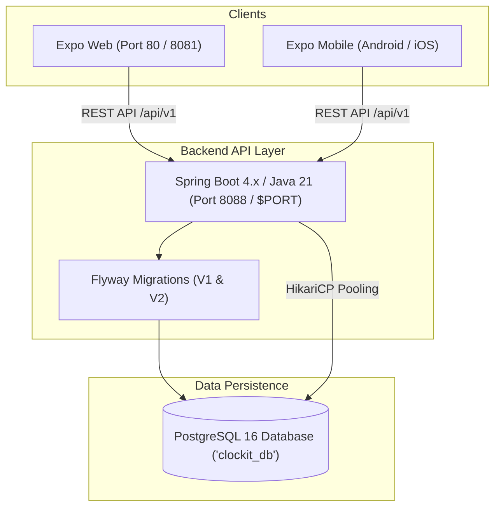

# ⏳ CLOCK-IT

> **Event-Driven Milestone Habit & Glow Tracker**  
> Built with **Spring Boot 4.x (Java 21)**, **PostgreSQL 16**, and **React Native (Expo 54)**.

---

## 🌟 Architecture Overview



---

## 📱 Features

- **Event Countdown & Phase Engine**: Automatic calculation of days remaining and dynamic phase transitions (*Foundation, Build, Refine, Arrival, Maintenance*).
- **Streak & Adherence Tracking**: Daily commitment streaks with active weekly adherence strips.
- **Daily Glow Routines (0/4 Raw State)**:
  - ⚖️ **Weight Tracker**: AM/PM records with unit conversion (kg/lbs) and stepper controls.
  - 🧴 **Skincare Protocol**: Morning SPF & Vitamin C protection tracking.
  - 🌸 **Hair & Body Care**: Scalp oiling, dry brushing, and body scrub routines.
  - 🏋️ **Split Workout Tracker**: Progressive overload definition logging.
- **Calendar History Inspector**: Per-day breakdown of past adherence and metrics.
- **Milestone Customizer**: Flexible event type selection (*Wedding, Birthday, Vacation, Fitness Goal*) and custom date pickers.

---

## 🚀 Quick Start (Local Development)

### 1. Backend & Database
```bash
# Start Spring Boot (Port 8088)
cd backend
./mvnw spring-boot:run
```

### 2. Frontend
```bash
# Start Expo (Port 8081)
cd mobile
npm install
npx expo start
```
* Open **[http://localhost:8081](http://localhost:8081)** in your web browser.

---

## 🐳 Docker Deployment

To spin up the entire production stack (PostgreSQL + Spring Boot + Nginx Web) in one command:

```bash
docker compose up --build -d
```
* **Frontend**: `http://localhost` (Port 80)
* **Backend API**: `http://localhost:8088/api`

---

## ☁️ Cloud Deployment (Render.com)

1. Connect this repository to [Render.com](https://render.com).
2. Render reads [`render.yaml`](./render.yaml) and automatically provisions:
   - **PostgreSQL Database** (`clockit-postgres`)
   - **Spring Boot API Web Service** (`clockit-backend`)
   - **Expo Web Static Frontend** (`clockit-frontend`)
